# 🚴 AAA Bikes — Sales Report | Power BI Project

Dashboard interactif Power BI construit à partir de données brutes extraites d'une base Access (.accdb), avec transformation complète dans Power Query et visualisation finale.

---

## 📁 Source de données

- **Type :** Microsoft Access Database (3 tables liées)
- **Tables :** `SalesT` (transactions) · `Location` (villes) · `Product` (produits)
- **Volume :** +3 millions de lignes après jointures
- **📥 Télécharger la base de données Access :** [AAA Bikes — Fichier Access (.accdb)](https://drive.google.com/file/d/17-VdGrs5L8mHQ6Qtl6JA4rSxd11YegeZ/view)

---

## 🔄 Étapes de transformation — Power Query

### Étape 1 — Données brutes depuis Access (3 feuilles)

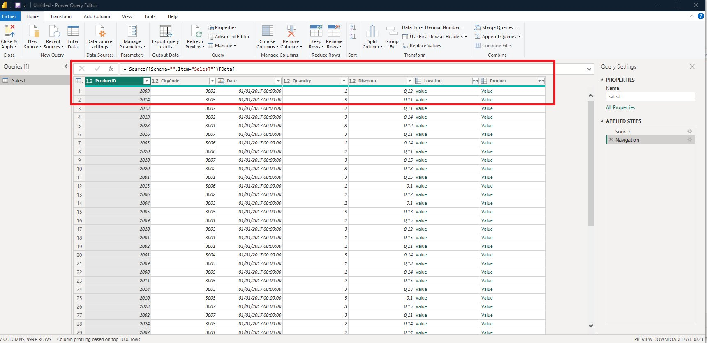

Importation de la table `SalesT` depuis Access. Les colonnes `Location` et `Product` apparaissent sous forme de colonnes imbriquées (type `Record`), nécessitant une expansion.

---

### Étape 2 — Expansion de la colonne Location → City

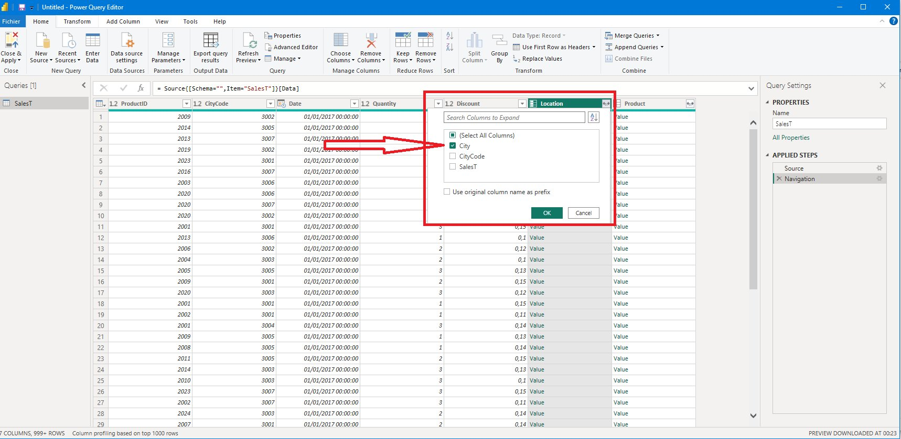

Expansion de la colonne `Location` en sélectionnant uniquement le champ **City**, sans préfixe. Cela rapatrie les noms des villes égyptiennes (Le Caire, Alexandrie, Giza, Ismaïlia…) directement dans la table principale.

```m
= Table.ExpandRecordColumn(_SalesT, "Location", {"City"}, {"City"})
```

---

### Étape 3 — Expansion de la colonne Product → ProductName, Category, Price

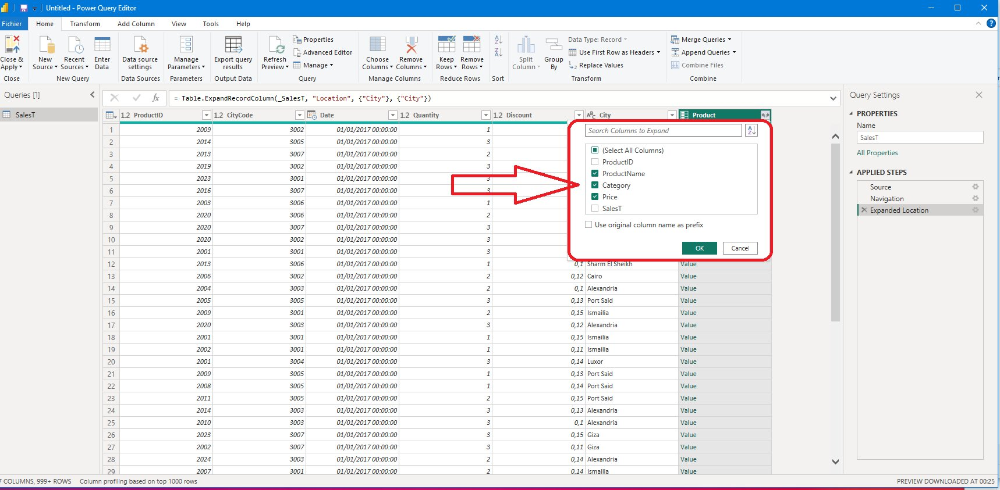

Expansion de la colonne `Product` en sélectionnant **ProductName**, **Category** et **Price**, sans préfixe.

```m
= Table.ExpandRecordColumn(#"Expanded Location", "Product", {"ProductName", "Category", "Price"}, {"ProductName", "Category", "Price"})
```

---

### Étape 4 — Ajout de la colonne personnalisée SalesValue

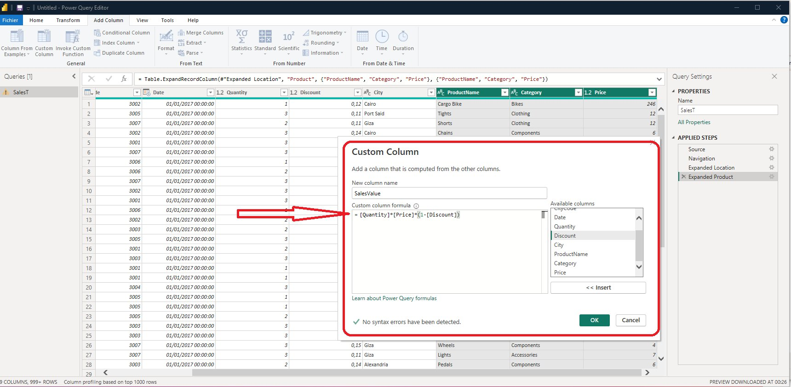

Création d'une colonne calculée `SalesValue` représentant le chiffre d'affaires net par ligne, après application du rabais :

```m
= [Quantity] * [Price] * (1 - [Discount])
```

---

### Étape 5 — Correction des types de données

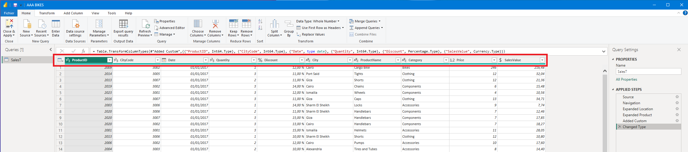

Attribution des types corrects à chaque colonne :

| Colonne | Type |
|---|---|
| ProductID | Int64 |
| CityCode | Int64 |
| Date | Date |
| Quantity | Int64 |
| Discount | Percentage |
| SalesValue | Currency |

---

## 📐 Mesures DAX

### Étape 6 — Mesure : SalesTotal

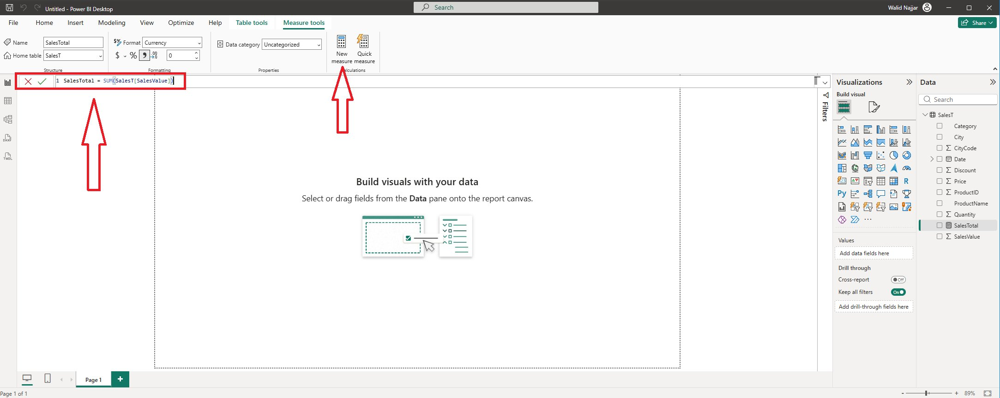

```dax
SalesTotal = SUM(SalesT[SalesValue])
```

Somme du chiffre d'affaires net sur l'ensemble des transactions.

---

### Étape 7 — Mesure : TotalQuantity

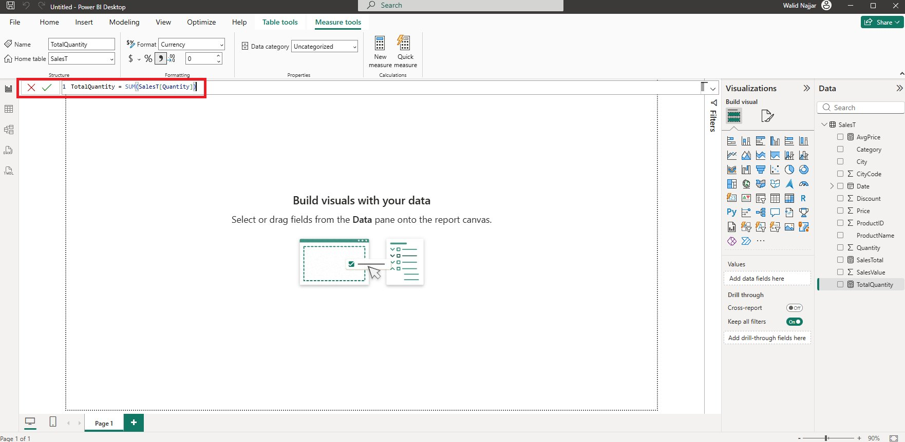

```dax
TotalQuantity = SUM(SalesT[Quantity])
```

Nombre total d'unités vendues.

---

### Étape 8 — Mesure : AvgPrice

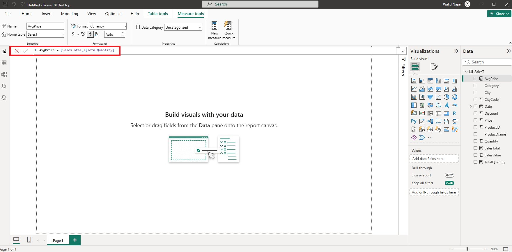

```dax
AvgPrice = [SalesTotal] / [TotalQuantity]
```

Prix moyen pondéré par les quantités vendues.

---

## 🧹 Nettoyage du modèle

### Étape 9 — Masquage des colonnes inutilisées

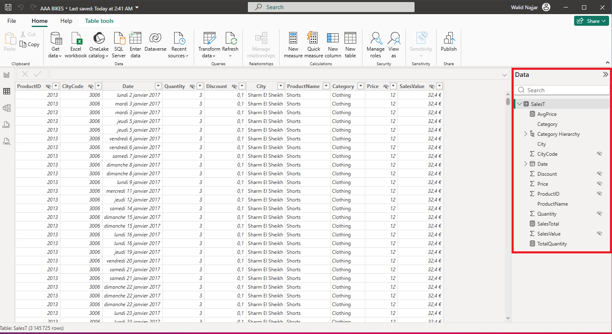

Masquage des colonnes techniques (CityCode, ProductID, SalesValue brut) dans la vue rapport pour alléger le panneau Data et guider l'utilisateur vers les mesures.

---

## 📊 Construction des visuels

### Étape 10 — Tableau KPIs par Catégorie et Produit

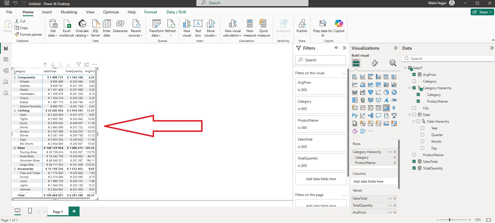

Tableau hiérarchique (Category → ProductName) affichant **SalesTotal**, **TotalQuantity** et **AvgPrice** pour chaque groupe. Les Bikes dominent avec **€148M** de CA total.

---

### Étape 11 — Carte géographique par Ville

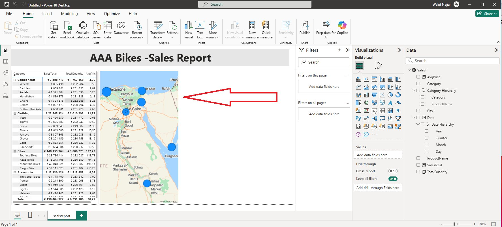

Visuel carte Power BI localisant les 7 villes de vente en Égypte (Le Caire, Alexandrie, Giza, Port Said, Ismaïlia, Louxor, Sharm El-Sheikh) avec des bulles proportionnelles au CA.

---

### Étape 12 — Graphique en barres : SalesTotal par Catégorie

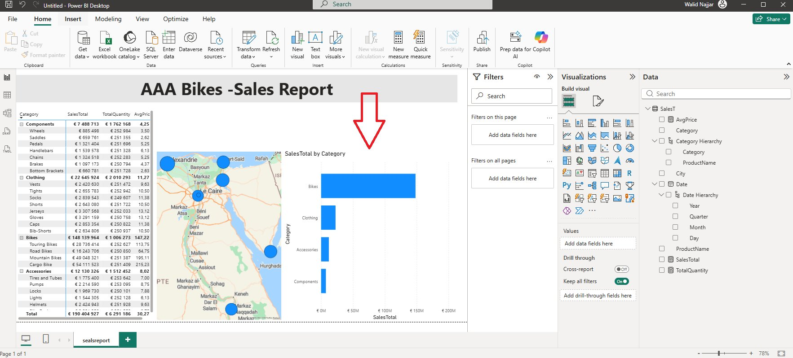

Comparaison visuelle des 4 catégories :
- 🥇 **Bikes** — €148M
- 🥈 **Clothing** — €22M
- 🥉 **Accessories** — €12M
- **Components** — €7M

---

## 🖥️ Dashboard Final

### Étape 13 — Rapport interactif complet

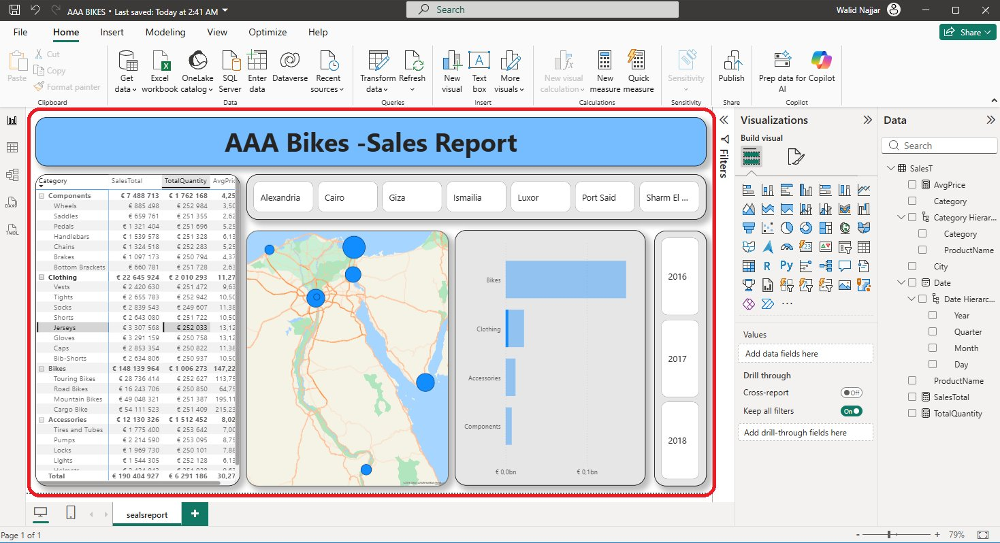

Le rapport final `sealsreport` regroupe sur une seule page :
- **Titre** stylisé avec fond bleu
- **Slicer** par ville (boutons)
- **Tableau KPI** hiérarchique (Catégorie → Produit)
- **Carte** géographique Égypte
- **Bar chart** SalesTotal par Catégorie
- **Timeline** par année (2016 · 2017 · 2018)

---

## 🗂️ Structure du projet

```
aaa-bikes-powerbi/
├── README.md
├── AAA BIKES.pbix
└── screenshots/
    ├── 01-raw-data-access-3-sheets.png
    ├── 02-expand-location-city-column.png
    ├── 03-expand-product-name-category-price.png
    ├── 04-add-custom-column-salesvalue.png
    ├── 05-fix-data-types.png
    ├── 06-measure-salestotal.png
    ├── 07-measure-totalquantity.png
    ├── 08-measure-avgprice.png
    ├── 09-hide-unused-columns.png
    ├── 10-table-kpis-by-category.png
    ├── 11-map-visual-by-city.png
    ├── 12-bar-chart-salestotal-by-category.png
    └── 13-final-dashboard.png
```

> **Note :** Pour ouvrir le fichier `AAA BIKES.pbix`, vous avez besoin de [Power BI Desktop](https://powerbi.microsoft.com/desktop/) (gratuit).  
> La source de données Access doit être re-pointée vers le fichier local après téléchargement.

---

## 🛠️ Stack technique


---

## 👤 Auteur

**Walid Najjar** — [WalidDataLab](https://github.com/WalidDataLab)
